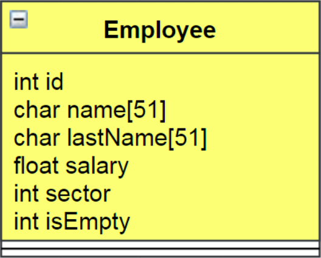

[Volver](../README.md)
# Trabajo Práctico número 2
## 1. Enunciado
Una empresa requiere un sistema para administrar su nómina de empleados. Se sabe que dicha nómina bajo ninguna circunstancia superara los 1000 empleados.

* Datos:
<p style="max-width: 250px; display:block; margin:auto;">
    
</p>

El sistema deberá tener el siguiente menú de opciones:
1. __ALTAS:__ Se debe permitir ingresar un empleado calculando automáticamente el número de Id. El resto de los campos se le pedirá al usuario.
1. __MODIFICAR:__ Se ingresará el Número de Id, permitiendo modificar: o Nombre o Apellido o Salario o Sector.
1. __BAJA:__ Se ingresará el Número de Id y se eliminará el empleado del sistema.
1. __INFORMAR:__
    1. Listado de los empleados ordenados alfabéticamente por Apellido y Sector.
    1. Total y promedio de los salarios, y cuántos empleados superan el salario promedio.
> NOTA: Se deberá realizar el menú de opciones y las validaciones a través de funciones. Tener en cuenta que no se podrá ingresar a los casos 2, 3 y 4, sin antes haber realizado la carga de algún empleado.

Para la realización de este programa, se utilizará una biblioteca llamada `ArrayEmployees` que facilitará el manejo de la lista de empleados y su modificación. En la sección siguiente se detallan las funciones que esta biblioteca debe tener.
## 2. Biblioteca `ArrayEmployees`
Agrupa funciones que permiten trabajar con los datos almacenados en la estructura `Employee`, la cual representa los datos de un empleado de la empresa.
```c
struct
{
    int id;
    char name[51];
    char lastName[51];
    float salary;
    int sector;
    int isEmpty;
}typedef Employee;
```
### 2.1. Función `initEmployees`
Para indicar que todas las posiciones del array están vacías, esta función pone la bandera (`isEmpty`) en TRUE en todas las posiciones del array.
```c
/** \brief
 *      To indicate that all position in the array are empty,
 *      this function put the flag (isEmpty) in TRUE in all
 *      position of the array
 * \param list Employee* Pointer to array of employees
 * \param len int Array length
 * \return int
 *      (-1) if Error [Invalid length or NULL pointer]
 *      (0) if Ok
 *
 */
int initEmployees(Employee* list, int len)
{
    return 0;
}
```
* Ejemplo de uso:
```c
r = initEmployees(arrayEmployees, ELEMENTS);
```
### 2.2. Función `addEmployees`
Agrega en un array de empleados existente los valores recibidos como parámetro en la primer posición libre.
```c
/** \brief
 *      add in a existing list of employees
 *      the values received as parameters
 *      in the first empty position
 * \param list employee*
 * \param len int
 * \param id int
 * \param name[] char
 * \param lastName[] char
 * \param salary float
 * \param sector int
 * \return int
 *      (-1) if Error [Invalid length or NULL pointer or without free space]
 *      (0) if Ok
 *
 */
int addEmployee(Employee* list, int len, int id, char name[], char
lastName[], float salary, int sector)
{
    return -1;
}
```
* Ejemplo uso:
```c
r = addEmployee(arrayEmployees, ELEMENTS, id, name, lastName, salary, sector);
```
### 2.3. Función `findEmployeeById`
Busca un empleado recibiendo como parámetro de búsqueda su Id.
```c
/** \brief
 *      find an Employee by Id and returns
 *      the index position in array.
 *
 * \param list Employee*
 * \param len int
 * \param id int
 * \return
 *      employee index position or 
 *      (-1) if [Invalid length or NULL pointer received or employee not found]
 *
 */
int findEmployeeById(Employee* list, int len, int id)
{
    return NULL
}
```
* Ejemplo uso:
```c
int index = findEmployeeById(arrayEmployees, ELEMENTS, 9);
```
### 2.4. Función `removeEmployee`
Elimina de manera lógica (`isEmpty` Flag en 1) un empleado recibiendo como parámetro su Id.
```c
/** \brief
 *      Remove a Employee by Id (put isEmpty Flag in 1)
 *
 * \param list Employee*
 * \param len int
 * \param id int
 * \return int
 *      (-1) if Error [Invalid length or NULL pointer or if can't find a employee]
 *      (0) if Ok
 *
 */
int removeEmployee(Employee* list, int len, int id)
{
    return -1;
}
```
* Ejemplo uso:
```c
r = removeEmployee(arrayEmployees, ELEMENTS, 20);
```
### 2.5. Función `sortEmployees`
Ordena el array de empleados por apellido y sector de manera ascendente o descendente.
```c
/** \brief
 *      Sort the elements in the array of employees,
 *      the argument order indicate UP or DOWN order
 *
 * \param list Employee*
 * \param len int
 * \param order int [1] indicate UP - [0] indicate DOWN
 * \return int
 *      (-1) if Error [Invalid length or NULL pointer]
 *      (0) if Ok
 *
 */
int sortEmployees(Employee* list, int len, int order)
{
    return 0;
}
```
* Ejemplo uso:
```c
r = sortEmployeeByName(arrayEmployees, ELEMENTS, 1);
```
### 2.6. Función `printEmployees`
Imprime el array de empleados de forma encolumnada.
```c
/** \brief
 *      print the content of employees array
 *
 * \param list Employee*
 * \param length int
 * \return int
 *
 */
int printEmployees(Employee* list, int length)
{
    return 0;
}
```
* Ejemplo uso:
```c
r = printEmployees(arrayEmployees, ELEMENTS);
```
## 3. Cómo realizar y entregar el trabajo práctico
El trabajo práctico deberá ser entregado en el repositorio de GIT correspondiente al TP2 de la materia.

El mismo consistirá en el proyecto de `Code::Blocks` con el programa funcionando y comentado, respetando las reglas de estilo de la cátedra. La compilación no deberá arrojar mensajes de error ni de warnings.

El proyecto deberá contar con la biblioteca descripta en la sección número dos, y se deberá hacer uso de dichas funciones para resolver la lógica del programa.
### 3.1. Objetivo
El objetivo del siguiente trabajo es que el alumno sea capaz de demostrar que puede integrar los conocimientos aprendidos hasta la clase 12. Los conocimientos necesarios para la realización del TP son los siguientes:
* Manejo de arrays.
* Manejo de pasaje por referencia.
* Manejo de estructuras.